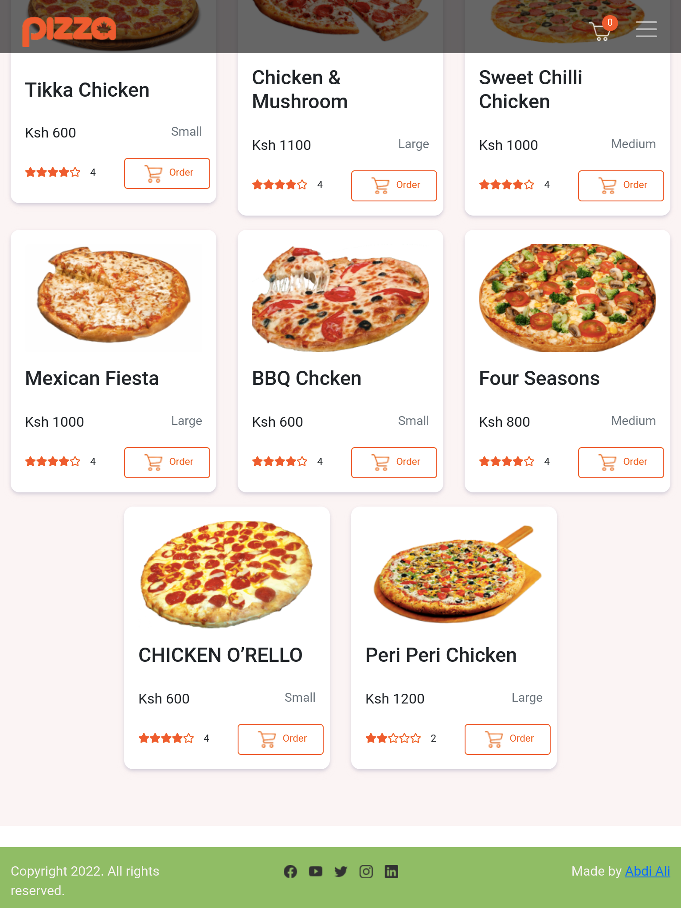

# Pizza Restaurents

## Author

[Abdi-Ali](https://github.com/Abdi-Ali33)

## Description

A pizza ordering website that allows users to order different sizes of pizza with one or more toppings and crust. The user can also request for delivery of the pizza at their homes.

## Screenshot

## Technologies Used

- HTML
- CSS
- Bootstrap
- JS
- JQuery

## Installation / Setup instruction

1. Open Terminal {Ctrl+Alt+T}

2. Clone the project-

   git clone `https://github.com/Abdi-Ali33/Pizza-Delivery-website.git`

3. Navigate to the cloned or downloaded folder
4. Open index.html file with your browser

## Behaviour Driven Development(BDD)

1. Choose the size of pizza I want e.g Small, Medium, Large
1. Choose what kind of crust I would like the pizza to have e.g Crispy, Stuffed, Gluten-free
1. Choose the topping(s) I want on my pizza.
1. Place an order for my Pizza and see the total charge for it.
1. Have an option to order as many pizzas as I want.
1. Have an option to have the pizza delivered or not. If delivered I want to be alerted how much the delivery charge will be.
1. If I want my pizza to be delivered, I want to be prompted to enter where the delivery should be made and an alert saying '' your order will be delivered to your location"
1. See a checkout button that when clicked shows the total amount charged for the orders.

## Licence

MIT License

Copyright (c) 2022 Abdi-Ali33

Permission is hereby granted, free of charge, to any person obtaining a copy
of this software and associated documentation files (the "Software"), to deal
in the Software without restriction, including without limitation the rights
to use, copy, modify, merge, publish, distribute, sublicense, and/or sell
copies of the Software, and to permit persons to whom the Software is
furnished to do so, subject to the following conditions:

The above copyright notice and this permission notice shall be included in all
copies or substantial portions of the Software.

THE SOFTWARE IS PROVIDED "AS IS", WITHOUT WARRANTY OF ANY KIND, EXPRESS OR
IMPLIED, INCLUDING BUT NOT LIMITED TO THE WARRANTIES OF MERCHANTABILITY,
FITNESS FOR A PARTICULAR PURPOSE AND NONINFRINGEMENT. IN NO EVENT SHALL THE
AUTHORS OR COPYRIGHT HOLDERS BE LIABLE FOR ANY CLAIM, DAMAGES OR OTHER
LIABILITY, WHETHER IN AN ACTION OF CONTRACT, TORT OR OTHERWISE, ARISING FROM,
OUT OF OR IN CONNECTION WITH THE SOFTWARE OR THE USE OR OTHER DEALINGS IN THE
SOFTWARE.

## Live Link

[Here is live link to the site](https://abdi-ali33.github.io/Pizza-Delivery-website/)

## Authors Info

Slack Profile - [Abdi Ali](https://app.slack.com/client/T0101L740P4/D032HD8S7CP)

Github Profile- https://github.com/Abdi-Ali33
